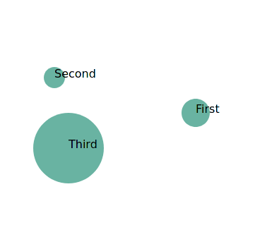

# akka-http-scalajs-d3
This project showcases how to use Scala.js with akka HTTP backend.
The popular js d3 drawing library is used to draw few circles.

This is a screenshot of the app:



The project contains three parts:
* `client` - Scala.js based
* `backend` - AKKA HTTP backend
* `shared` - shared code can be used by both the client and the backend. There are however limitations on which libraries
can be used here.
 
The info about the circles is loaded from the backend. The backend exposes the data as Json via HTTP endpoint.
The app requires HTTP basic authentication. Use the following credentials:
* Username: **test**
* Password: **test**

The shared code is placed under shared. Shared code enables e.g. to define domain model classes which can be used
by both the backend and the frontend.

# Run with:
```shell
$ sbt
> project server
> ~reStart
```
open http://localhost:8080

# Create executable jar file
```shell
$ sbt
> project server
> assembly
```

# Run:
```shell
$ java -jar server/target/scala-2.13/server-assembly-0.1.0-SNAPSHOT.jar
```

# This setup uses:
* [scalajs-bundler](https://scalacenter.github.io/scalajs-bundler/)
* [akka-http-scalajs template](https://github.com/vmunier/akka-http-scalajs.g8)
* [d3 scala js lib](https://github.com/fdietze/scala-js-d3v4)
* [d3](https://d3js.org/)

# Disclaimer:
This is most probably not the best way to setup the project, but it should give you a base from which you can
start with d3. I struggled to get the setup with d3 for trying things out and that is why I decided to share this setup.
